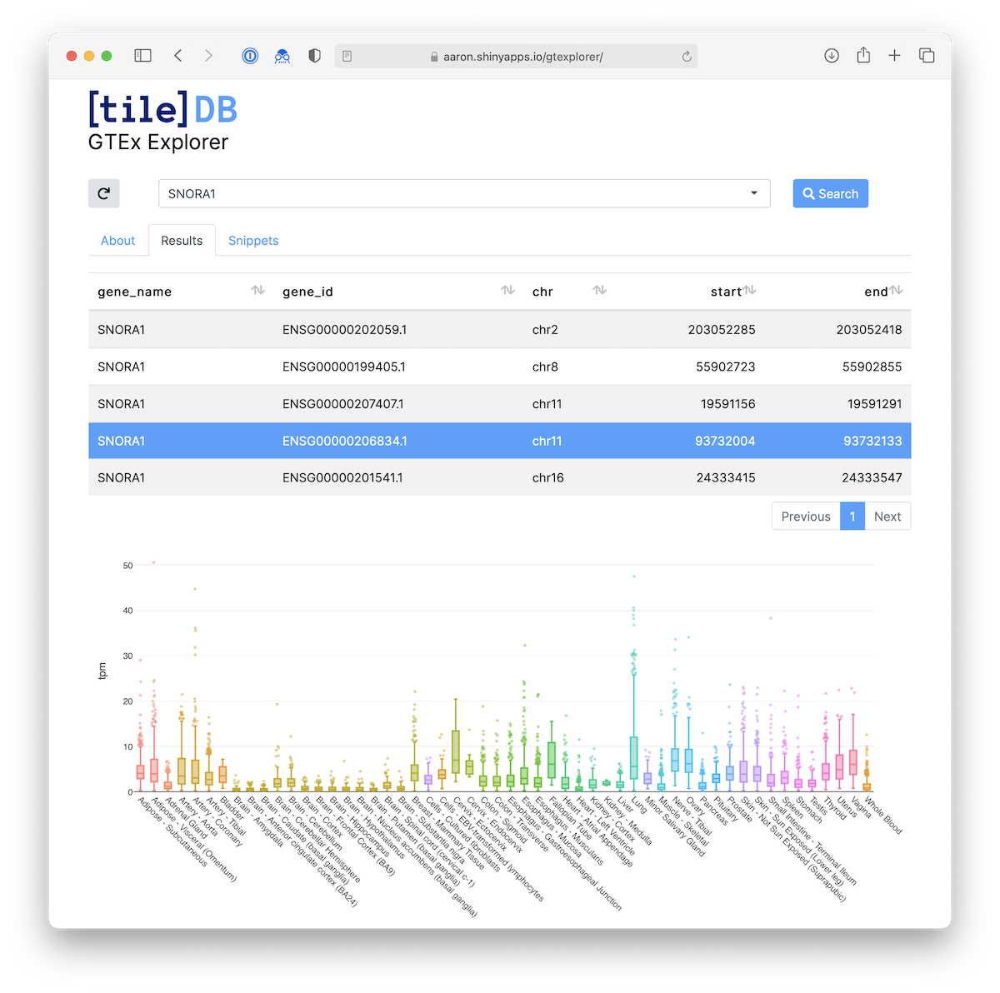

# gtexplorer

Explore GTEx RNA-seq data stored in an S3 TileDB array. Launch the app [here](https://aaron.shinyapps.io/gtexplorer/).



## Installation

You can install the latest release of gtexplorer from GitHub:

``` r
remotes::install_github("tiledb-inc/gtexplorer", remotes::github_release())
```

## Citation

The Genotype-Tissue Expression (GTEx) Project was supported by the Common Fund  of the Office of the Director of the National Institutes of Health, and by NCI, NHGRI, NHLBI, NIDA, NIMH, and NINDS. The data used for this app were obtained from: the GTEx Portal on 05/12/21.
